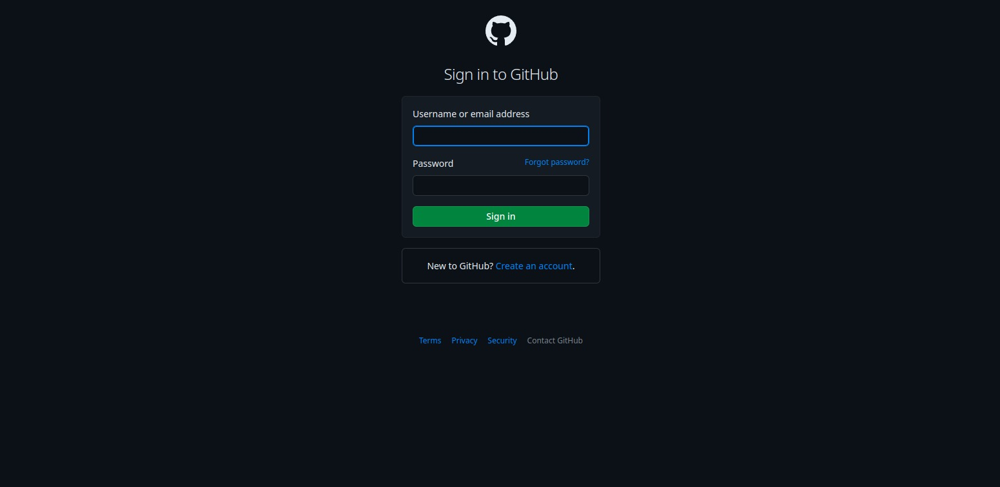

# Clone da página de login do GitHub

Este é um exercício proposto para clonar a página de login do GitHub.

---
## Habilidades

* Manipular HTML
* Manipular CSS

---
## Desenvolvimento

* Desenvolva uma aplicação de um jogo de adivinhação de cores.

---
### Antes de começar a desenvolver:
1. Instale as dependências e inicialize o projeto
  * `npm install` ou `yarn install`
2. Crie uma branch a partir da branch `main`
  * Verifique se você está na branch `main`
    * Exemplo: `git branch`
  * Se não estiver, mude para a branch `main`
    * Exemplo: `git checkout main`
  * Agora, crie uma branch onde você vai guardar os `commits` do seu projeto
    * Você deve criar uma branch no seguinte formato: `nome-de-usuario-nome-do-projeto`
    * Exemplo: `git checkout -b rodrigo-github-clone`
3. Crie na raiz do projeto os arquivos que você precisará desenvolver:
  * Verifique que você está na raiz do projeto
    * Exemplo: `pwd`
  * Crie os arquivos `index.html` e `style.scss`
    * Exemplo: `touch index.html style.css`
4. Adicione as mudanças ao _stage_ do Git e faça um `commit`
  * Verifique que as mudanças ainda não estão no _stage_
    * Exemplo: `git status` (devem aparecer listados os novos arquivos em vermelho)
  * Adicione o novo arquivo ao _stage_ do Git
    * Exemplo:
      * `git add .` (adicionando todas as mudanças - _que estavam em vermelho_ - ao stage do Git)
      * `git status` (devem aparecer listados os arquivos em verde)
  * Faça o `commit` inicial
    * Exemplo:
      * `git commit -m 'iniciando o projeto.'` (fazendo o primeiro commit)
      * `git status` (deve aparecer uma mensagem tipo _nothing to commit_)
5. Adicione a sua branch com o novo `commit` ao repositório remoto
  * Usando o exemplo anterior: `git push -u origin rodrigo-github-clone`
6. Crie um novo `Pull Request` (_PR_)
  * Vá até a página de _Pull Requests_ do [repositório no GitHub](https://github.com/raugusto96/projects/pulls)
  * Clique no botão verde "_New pull request_"
  * Clique na caixa de seleção "_Compare_" e escolha a sua branch **com atenção**
  * Clique no botão verde "_Create pull request_"
  * Adicione uma descrição para o _Pull Request_, um título claro que o identifique, e clique no botão verde "_Create pull request_"
  * **Não se preocupe em preencher mais nada por enquanto!**
  * Volte até a [página de _Pull Requests_ do repositório](https://github.com/raugusto96/projects/pulls) e confira que o seu _Pull Request_ está criado

---
### Durante o desenvolvimento

* Faça `commits` das alterações que você fizer no código regularmente

* Lembre-se de sempre após um (ou alguns) `commits` atualizar o repositório remoto

* Os comandos que você utilizará com mais frequência são:

  1. `git status` (_para verificar o que está em vermelho - **fora do stage** - e o que está em verde - **no stage**_)
  2. `git add` (_para adicionar arquivos ao **stage** do Git_)
  3. `git commit` (_para criar um commit com os arquivos que estão no **stage** do Git_)
  4. `git push` (_para enviar o commit para o repositório remoto após o passo anterior_)
  5. `git push -u nome-da-branch` (_para enviar o commit para o repositório remoto na primeira vez que fizer o push de uma nova branch_)

---
### Como desenvolver

## Linter

Para garantir a qualidade do código, vamos utilizar neste projeto os linters `ESLint` e `StyleLint`.
Assim o código estará alinhado com as boas práticas de desenvolvimento, sendo mais legível
e de fácil manutenção! Para rodá-los localmente no projeto, execute os comandos abaixo:

```bash
npm run lint
npm run lint:styles
```
***ou***

```bash
yarn lint
yarn lint:styles
```

Quando é executando o comando `npm run lint:styles`, ele irá avaliar se os seguintes arquivos com a extensão `CSS` está com o padrão correto.

Quando é executando o comando `npm run lint`, ele irá avaliar se os seguintes arquivos com a extensão `JS` e `JSX` está com o padrão correto.

---
## Cypress

Cypress é uma ferramenta de teste de front-end desenvolvida para a web.
Você pode rodar o cypress localmente para verificar se seus requisitos estão passando, para isso execute o um dos seguintes comandos:

Para executar os testes apenas no terminal:

```bash
npm test
```

***ou***

```bash
yarn test
```

Para executar os testes e vê-los rodando em uma janela de navegador:

```bash
npm run cypress:open
```

***ou***

```bash
npx cypress open
```

***ou***

```bash
yarn cypress:open
```

Após executar um dos três comandos acima, será aberta uma janela de navegador e então basta clicar no nome do arquivo de teste que quiser executar (**project.spec.cy.js**), ou para executar todos os testes clique em _Run all specs_


**Para rodar o cypress é preciso ter rodado o comando npm install anteriormente.**
---
## Requisitos do projeto

### 💡 Veja o exemplo a seguir de como o projeto pode se parecer depois de pronto. Lembre-se que você pode ~~e deve~~ ir além para deixar o projeto com a sua cara e impressionar à todos!



---

# 👀 Observações importantes:

* Lembrem-se que como desenvolvedores devemos fazer pesquisas e garimpar resultados para auxiliar no entendimento do assunto. Assim, para solucionar os requisitos do projeto é inevitável e estimulado que pesquisas sejam feitas nas mais variadas fontes (google, youtube, etc) sempre tomando cuidado para utilizar fontes "**confiáveis**" nas pesquisas da Internet, como por exemplo:
  * [Javascript.com](javascript.com)
  * [W3Schools](https://www.w3schools.com/js/default.asp)
  * [MDN - Mozilla Developer Network](https://developer.mozilla.org/pt-BR/docs/Web/JavaScript)
  * [StackOverflow](https://pt.stackoverflow.com/questions/tagged/javascript)

---

# Requisitos do projeto

## 1 - Adicione no seu site um formulário para login

**O que será verificado:**

- Será verificado se o **id** do formulário é `login-form`.

## 2 - Adicione um campo de texto que conterá o email

**O que será verificado:**

- Será verificado se o seu **id** deve ser `email-input`;

## 3 - Adicione um campo de texto que conterá a senha

**O que será verificado:**

- Será verificado se o seu **id** deve ser `password-input`;

- Será verificado se o campo de texto possui o **type** de `password`.

## 4 - Adicione um botão para realizar o login

**O que será verificado:**

- Será verificado se o seu **id** deve ser `login-button`.
